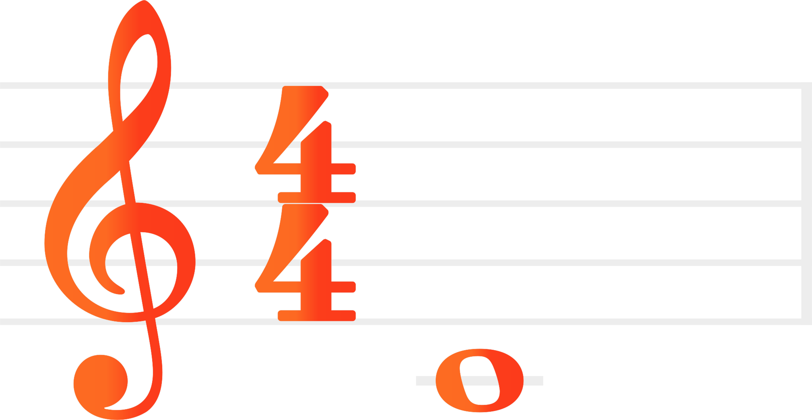

# Swift Musical eXtensible Language 

This package is a fork of the original 
[dn-m/MusicXML](https://github.com/dn-m/MusicXML).


A **Work-In-Progress** implementation of the [musicXML](https://www.musicxml.com) specification in Swift.

The goal of this project is to allow Swift users to read, manipulate, and write musicXML files in a _richly-typed_ manner on any platform supported by Swift.

## Hello, world!

Let's construct the "Hello, world!" score example from the [musicXML documentation](https://www.musicxml.com/tutorial/hello-world/). This musical composition consists of one measure that contains a whole note on middle C, based in 4/4 time.

### Graphical Representation

When rendered graphically, this score example should look something like this:



### XML Representation

The musicXML representation looks like this:

```XML
    <?xml version="1.0" encoding="UTF-8" standalone="no"?>
    <!DOCTYPE score-partwise PUBLIC
        "-//Recordare//DTD MusicXML 4.0 Partwise//EN"
        "http://www.musicxml.org/dtds/partwise.dtd">
    <score-partwise version="4.0">
      <part-list>
        <score-part id="P1">
          <part-name>Music</part-name>
        </score-part>
      </part-list>
      <part id="P1">
        <measure number="1">
          <attributes>
            <divisions>1</divisions>
            <key>
              <fifths>0</fifths>
            </key>
            <time>
              <beats>4</beats>
              <beat-type>4</beat-type>
            </time>
            <clef>
              <sign>G</sign>
              <line>2</line>
            </clef>
          </attributes>
          <note>
            <pitch>
              <step>C</step>
              <octave>4</octave>
            </pitch>
            <duration>4</duration>
            <type>whole</type>
          </note>
        </measure>
      </part>
    </score-partwise>
```

### `MusicXML` Representation

To construct the "Hello, world!" example in Swift looks like this:

```Swift
let note = Note(
    pitch: Pitch(step: .c, octave: 4), 
    duration: 4, 
    type: .whole
)
let key = Key(fifths: 0)
let time = Time(4,4)
let clef = Clef(sign: .g, line: 2)
let attributes = Attributes(
    divisions: 1,
    keys: [key],
    times: [Time(
        [
            Time.Signature(
                beats: ["4"],
                beatType: ["4"]
            )] 
    )],
    clefs: [clef]
)
let measure = Partwise.Measure(
    number: "1",
    musicData: [
        .attributes(attributes),
        .note(note)
    ]
)
let part = Partwise.Part(id: "P1", measures: [measure])
let header = Header(
    partList: [
        .part(ScorePart(id: "P1", name: "Music"))
    ]
)
let traversal = Partwise(header: header, parts: [part])
let score = Score.partwise(traversal)
```

### 🧬 Decoding musicXML into a `Score`

You can decode a `Score` in a variety of ways:

```Swift
let fromData = try Score(data: data)
let fromString = try Score(string: string)
let fromURL = try Score(url: url)
```

### 🚧 Work-in-progress: Encoding a `Score` into musicXML

[Pre-release version 0.3.0](https://github.com/Treata11/SwiftMXL/milestone/1) will see the completion of the encoding from a `Score` into the musicXML format.

## Getting Started

### Requirements

Use the [Swift Package Manager](https://swift.org/package-manager/) to include the `SwiftMXL` module into your project.

[comment]: <> ( ### Usage)

[comment]: <> ( If you want to use the `SwiftMXL` module in your own project, add the `SwiftMXL` package to the `dependencies` section of your `Package.swift` file:)

### Development

To contribute to the `SwiftMXL` package, clone the `git` repository:

```BASH
git clone git@github.com:Treata11/SwiftMXL.git && cd SwiftMXL
```

Build the package:

```BASH
swift build
```

Run the tests:

```BASH
swift test
```

#### If you use **Xcode**:

`open package.swift` or simply `xed .`

### Development Roadmap

The upcoming pre-release versions will be focused on completing different tasks.

### 0.3.0

Pre-release version **0.3.0** will be defined by completing the implementation of the **encoding** of **abstract musical content**. The LilyPond Test Suite tests will be transformed into round-trip tests to ensure that the plumbing is clean.

### 0.4.0

Pre-release version **0.4.0** will be defined by refining the public interfaces exposed by the `SwiftMXL` package. Up until this point, public initializers may be somewhat clumsy.

## More Resources

See the 
[MusicXML XSD Schema Reference](http://usermanuals.musicxml.com/MusicXML/MusicXML.htm#MusicXMLReference.htm%3FTocPath%3DMusicXML%2520Reference%7C_____0) for more information about how MusicXML is structured.
